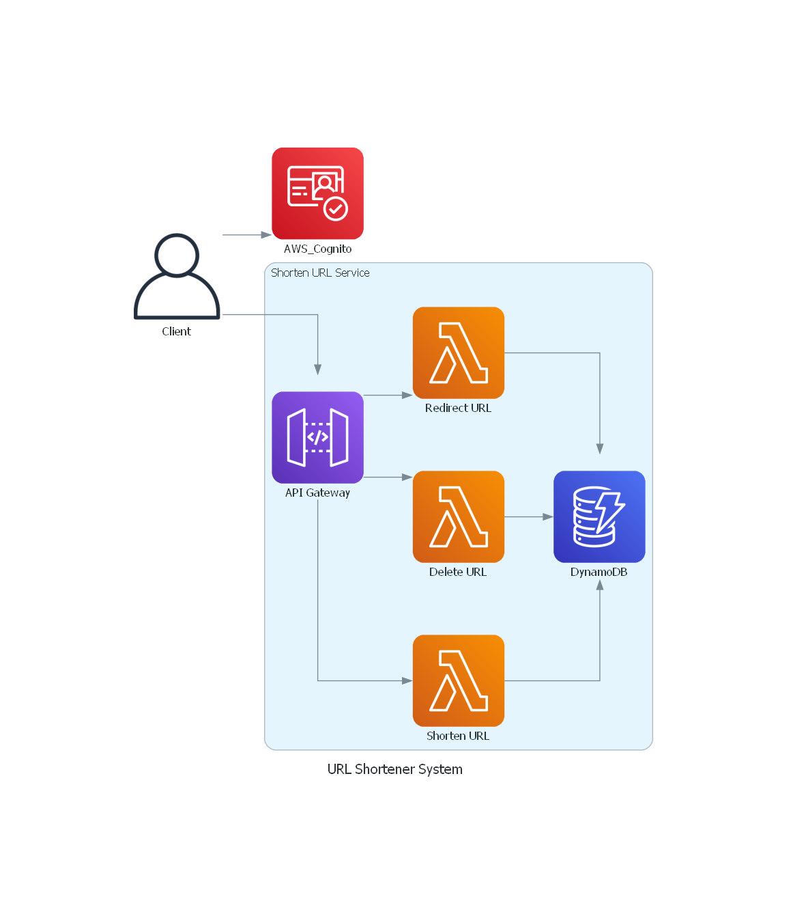

# URL Shortener Service

The URL shortener service provides three key functionalities:

1. **Create Shortened URLs**: Allows users to generate shorter versions of long URLs.
2. **Delete Shortened URLs**: Enables users to remove existing shortened URLs.
3. **Redirect Users**: When a shortened URL is accessed, the service redirects the user to the original long URL.

## System Design

Below is the system design diagram illustrating the flow:

## Workflow

1. **URL Shortening**:
   - The client interacts with a static website hosted in an S3 bucket (cached using a CDN).
   - The client sends a POST request via API Gateway.
   - API Gateway triggers Lambda functions.
   - Lambda creates the shorter URL, records it in DynamoDB, and generates a static website that redirects to the long URL.

2. **URL Deletion**:
   - Similar to URL shortening, the client interacts with the static website.
   - A POST request via API Gateway triggers Lambda.
   - Lambda checks if the URL exists.
   - If authenticated, it deletes the URL from both DynamoDB and S3.

## Design Decisions

1. **S3 Static Website vs. AWS Amplify**:
   - AWS S3 offers cost-effectiveness, scalability, high availability, ease of use, and security for web hosting.
   - AWS Amplify, while more feature-rich, can be costlier and requires managing Git permissions using `.gitignore`.

2. **Shortened URL Duplication Prevention**:
   - Two approaches considered:
     - **Unique Short IDs**: Check if the generated short ID already exists; if so, regenerate a new one.
     - **Hash-Based Lookup**: Pre-create all possible short IDs and store them in the database. Provide a short ID when a user requests a shortened URL, and mark used entries.
   - The first approach was chosen due to cost considerations for this academic project.

## Learning
1. Redirecting using HTTP request instead of HTML static pages
HTML: https://redirect-sug.s3.us-west-2.amazonaws.com/d1B5LQLiMNL
HTTP: https://sqvreaj3o7.execute-api.us-west-2.amazonaws.com/dev/SSWDZBFFxSS

2. Lambda concurrency

## Reference
- High Level System Design: https://www.educative.io/courses/grokking-modern-system-design-interview-for-engineers-managers/system-design-tinyurl
- Hosting a static S3 Website: https://www.youtube.com/watch?v=-l83oqcaTHg
- AWS Cognito: https://www.youtube.com/watch?v=8a0vtkWJIA4
- AWS Cognito - Email Extraction: https://www.youtube.com/watch?v=ALgbhPaMT1M
- API Gateway Authentication: https://www.youtube.com/watch?v=9crTLAT_4uY
- IAM: https://www.youtube.com/watch?v=iF9fs8Rw4Uo
- Cognito Authentication: https://github.com/aws-amplify/amplify-js/tree/master/packages/amazon-cognito-identity-js