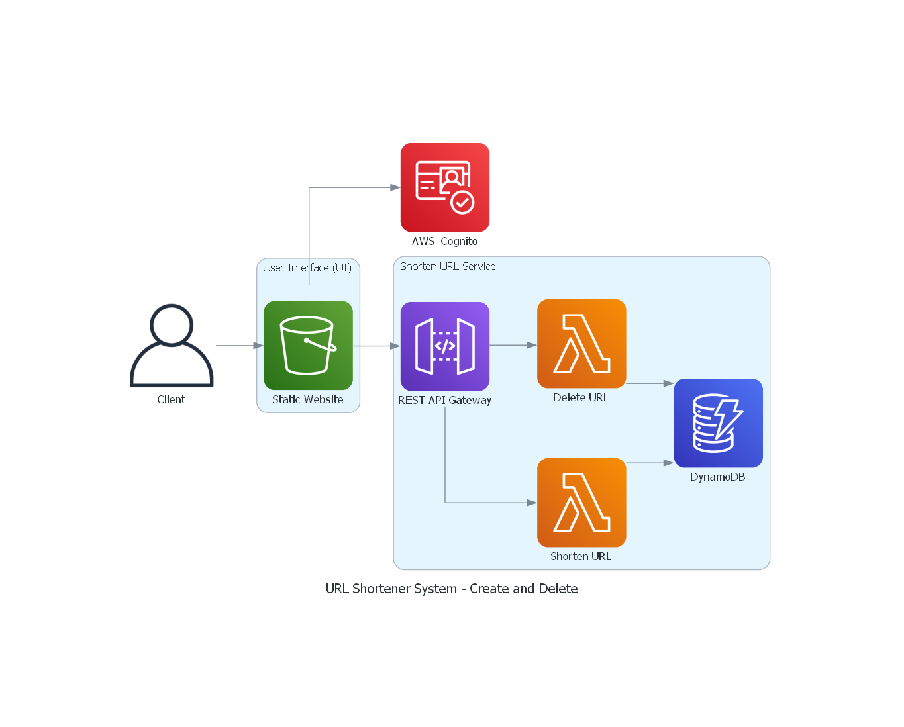
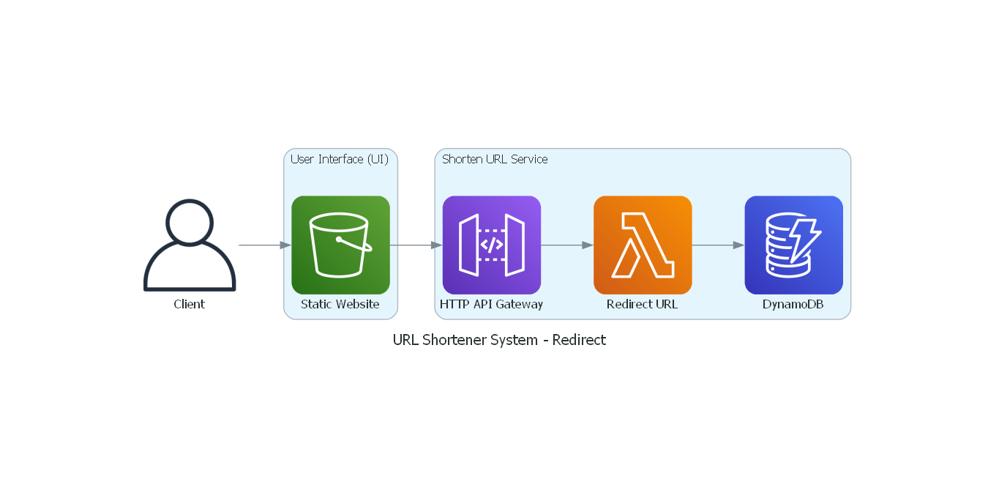

# [URL Shortener Service](https://karanchhabra99.github.io/URL-Shortening-Service/S3%20Website/Index.html)

This project is a URL shortening service built on AWS services. It provides a secure and scalable solution to create, delete, and redirect shortened URLs.

## Architecture

The system uses AWS Cognito for user authentication, allowing users to interact with the AWS API Gateway. The API Gateway can trigger any of the three AWS Lambda functions:

1. **Shorten URL Generator**: Generates a shortened URL for a given original URL.
2. **Delete Shorten URL**: Deletes a previously generated shortened URL.
3. **Redirect to Original URL**: Redirects a request from the shortened URL to the original URL.

All three Lambda functions interact with DynamoDB for data storage and retrieval.
Create and Delete Workflow

Redirect -  Workflow

## Features

- **User Authentication**: AWS Cognito is used for secure user authentication.
- **URL Shortening**: Generate a unique shortened URL for any given URL.
- **URL Deletion**: Delete a previously shortened URL.
- **URL Redirection**: Redirect from the shortened URL to the original URL.
- **Scalability and Performance**: The system is built on AWS services, ensuring high scalability and performance.

## Learning
### HTTP Request Redirection vs. Static HTML Pages

In the previous system, redirection was achieved by creating static HTML pages. When these pages were accessed, they would redirect the user to the final website. This was a two-step process: the user first landed on a static webpage, which then redirected to the final website. This approach resulted in high latency and caching was ineffective, as the cached output would still be the static website.

To improve this, we've implemented a new approach where users are sent an HTTP response to redirect them as soon as the API is triggered. This eliminates the need for the intermediate static webpage, reducing latency and making caching more effective.

Here are the links to the Short URLs created by both approaches:
- Static Website - HTML: `https://redirect-sug.s3.us-west-2.amazonaws.com/d1B5LQLiMNL`
- HTTP Response: `https://sqvreaj3o7.execute-api.us-west-2.amazonaws.com/dev/SSWDZBFFxSS`

In the old system architecture, for redirection, users only needed to interact with the S3 bucket.

### Project Directory Structure

Maintaining a consistent directory structure is crucial for ensuring readability and ease of navigation. Here's the recommended folder structure for this application:

- `Applications`: This folder contains the three Lambda functions.
- `System Design`: This folder houses the design scripts and related images.
- `Template`: This folder includes HTML and JS files.
- `Requirements`: This folder contains a .txt file listing the required packages along with their versions.
- `README.md`: This is the main documentation file for the project.

This structure ensures that all related files are grouped together, making it easier for contributors/reviwer to find what they're looking for.

### Analyzing Time Consumption for Each Step
When dealing with an application that interacts with multiple services, pinpointing which step consumes the most time can be challenging. For AWS services, there is a specific method to identify this. This involves using AWS X-Ray, a service that collects data about requests that your application serves, and provides tools you can use to view, filter, and gain insights into that data to identify issues and opportunities for optimization.

## Considerations and Trade-offs
1. **Lambda vs EC2 Instance**
   The application currently uses Lambda functions, which can experience latency due to the cold-start problem. An alternative would be to use an EC2 instance, which wouldn't require a startup each time the API is triggered, thereby reducing latency. However, as this is an educational project (and not a production application), we have opted for Lambda to leverage its pay-as-you-go model.

2. **Caching**
   Although the application currently does not implement any caching, introducing caching at the API layer and setting up a CDN could significantly reduce latency. However, as this is an educational project, the caching layer has not been implemented.

3. **Lambda Concurrency**
   To ensure consistent request output times when multiple users interact with the application, we would typically need multiple servers. In the case of Lambda, this would require setting up Lambda concurrency. However, as this is an educational project, Lambda concurrency has not been set up to prevent potential exploitation of the application.

## Reference
- High Level System Design: https://www.educative.io/courses/grokking-modern-system-design-interview-for-engineers-managers/system-design-tinyurl
- Hosting a static S3 Website: https://www.youtube.com/watch?v=-l83oqcaTHg
- AWS Cognito: https://www.youtube.com/watch?v=8a0vtkWJIA4
- AWS Cognito - Email Extraction: https://www.youtube.com/watch?v=ALgbhPaMT1M
- API Gateway Authentication: https://www.youtube.com/watch?v=9crTLAT_4uY
- IAM: https://www.youtube.com/watch?v=iF9fs8Rw4Uo
- Cognito Authentication: https://github.com/aws-amplify/amplify-js/tree/master/packages/amazon-cognito-identity-js